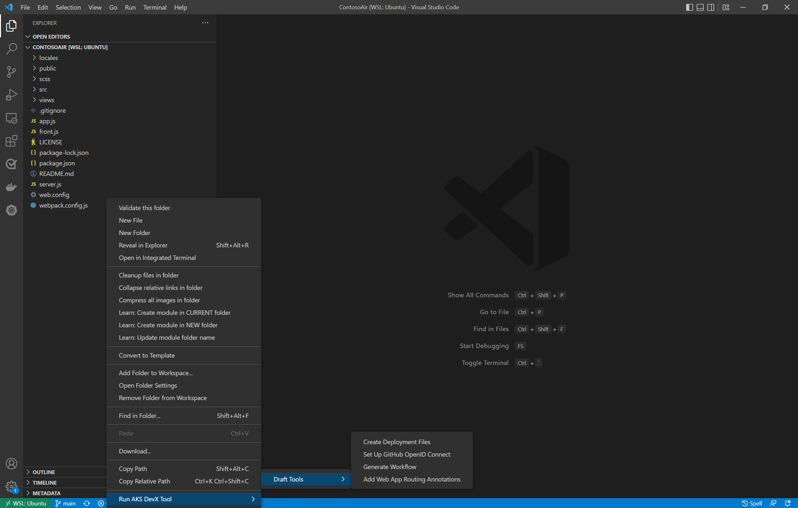

# Azure Kubernetes Service (AKS) DevX (Developer experience) Extension for Visual Studio Code (Preview)

The AKS DevX extension for Visual Studio Code (Preview) is an extension focused on enhancing your day-to-day life as a developer on Azure Kubernetes Service. This extension is focused on non-cluster developer experiences. If you are more interested in cluster operations, download the [aks-extension](https://marketplace.visualstudio.com/items?itemName=ms-kubernetes-tools.vscode-aks-tools).

The current list of experiences in this extension are:
-	[Draft](https://github.com/Azure/draft)

## Installation

1. Download and install the [Azure Kubernetes Service DevX Extension](https://marketplace.visualstudio.com/items?itemName=ms-kubernetes-tools.aks-devx-tools) for Visual Studio Code.

2. Wait for the extension to finish installing then reload Visual Studio Code when prompted.

3. Verify that the extension is installed by browsing your installed extensions and finding Azure Kubernetes Service DevX Extension

## Features

### Draft 

Draft makes it easier for developers to get started building apps that run on Kubernetes by taking a non-containerized application and generating the Dockerfiles, Kubernetes manifests, Helm charts, Kustomize configuration, and other artifacts associated with a containerized application. Draft can also generate a GitHub Actions workflow file to quickly build and deploy applications onto an AKS cluster.

To get started with Draft, right click your directory in your Visual Studio Code window. The window “Run AKS DevX Tool” holds the menu for Draft. Here, you can see all the Draft commands available to you. 

To properly use Draft to containerize your application, create manifest files, and deploy your application, you must use the commands in the following order: 
- Create Deployment Files
- Setup GitHub OpenID Connect
- Generate Workflow.

**Note:** Draft currently has a dependency on [Azure CLI](https://docs.microsoft.com/en-us/cli/azure/) and [GitHub CLI](https://cli.github.com/).

## Commands  

**Draft Create Deployment Files** adds the minimum required Dockerfile and manifest files for your deployment to the project directory.
- Supported deployment types: Helm, Kustomize, Kubernetes manifest.

**Draft Set Up GitHub OpenID Connect** automates the GitHub OIDC setup process for your project.

**Draft Generate Workflow** generates a GitHub Actions workflow for automatic build and deploy to a Kubernetes cluster.

**Draft Add Web App Routing Annotations** annotates your Kubernetes service manifest to expose it to the internet through Web App Routing.

## Building and packaging the extension

- Install the Visual Studio Extension Manager (VSCE) with `npm install --global vsce`
- Install dependencies with `npm install`
- Compile with `npm run compile` 
- Package with `npm run package` then `vsce package`

## Telemetry

This extension collects telemetry data to help us build a better experience for building applications with Azure Kubernetes Service and VS Code. We only collect the following data:

* Which commands are executed.

We do not collect any information about image names, paths, etc. Read our [privacy statement](https://privacy.microsoft.com/privacystatement) to learn more. If you don’t wish to send usage data to Microsoft, you can set the `telemetry.enableTelemetry` setting to `false`. Learn more in our [FAQ](https://code.visualstudio.com/docs/supporting/faq#_how-to-disable-telemetry-reporting).
## Contributing

This project welcomes contributions and suggestions.  Most contributions require you to agree to a
Contributor License Agreement (CLA) declaring that you have the right to, and actually do, grant us
the rights to use your contribution. For details, visit https://cla.opensource.microsoft.com.

When you submit a pull request, a CLA bot will automatically determine whether you need to provide
a CLA and decorate the PR appropriately (e.g., status check, comment). Simply follow the instructions
provided by the bot. You will only need to do this once across all repos using our CLA.

This project has adopted the [Microsoft Open Source Code of Conduct](https://opensource.microsoft.com/codeofconduct/).
For more information see the [Code of Conduct FAQ](https://opensource.microsoft.com/codeofconduct/faq/) or
contact [opencode@microsoft.com](mailto:opencode@microsoft.com) with any additional questions or comments.

## Trademarks

This project may contain trademarks or logos for projects, products, or services. Authorized use of Microsoft 
trademarks or logos is subject to and must follow 
[Microsoft's Trademark & Brand Guidelines](https://www.microsoft.com/en-us/legal/intellectualproperty/trademarks/usage/general).
Use of Microsoft trademarks or logos in modified versions of this project must not cause confusion or imply Microsoft sponsorship.
Any use of third-party trademarks or logos are subject to those third-party's policies.
